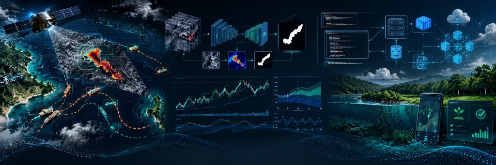

  

# Subodh
**AI/ML • Open Source • Data • Software Engineering**

I build applied AI/ML systems, data pipelines, and production-oriented software, while contributing upstream to open-source ML and developer ecosystems. My portfolio spans geospatial intelligence, financial forecasting, blockchain-backed MRV, backend systems, and ML infrastructure.

## Open Source

- **[Hugging Face Transformers](https://github.com/huggingface/transformers/pull/49192)** *(Open)*
  Fixed AutoTokenizer backend selection for CohereLabs tiny-aya checkpoints with regression coverage.
- **[Airbyte](https://github.com/airbytehq/airbyte/pull/87507)** *(Open)*
  Added configurable property-history support to the HubSpot source connector.
- **[mloda](https://github.com/mloda-ai/mloda/pull/1806)** *(Open)*
  Fixed filter evaluation so feature_group scope is checked before the candidate match hook.
- **[ms-swift](https://github.com/modelscope/ms-swift/pull/10289)** *(Open)*
  Fixed CLI help handling for empty, help, and unknown-command paths.
- **[Obsidian Agent](https://github.com/aeshef/obsidian-agent/pull/68)** *(Open)*
  Added per-chart reset controls with isolated state and regression coverage.
- **Corsair** *(Merged, PR #1398)*
  Developed and integrated the Dynapictures plugin.
- **Squidbrake** *(Merged, PR #51)*
  Added Windows, macOS, and Python 3.13 CI coverage.
- **CodePrism** *(Merged, PR #70)*
  Improved PEP 508 requirement parsing.
- **CodePrism** *(Merged, PR #72)*
  Added strict configuration-key validation and clearer configuration errors.

## Building

- **[Marine Pollution Intelligence](https://github.com/Subodh-17/Marine-Pollution-Intelligence-SIH)**
  An end-to-end oil-spill investigation platform combining Sentinel-1 SAR detection, PyTorch ML, drift modelling, AIS reconstruction, explainable vessel attribution, and FastAPI/React interfaces.
- **[StockVision](https://github.com/Subodh-17/stockvision-scilab-gui)**
  An interactive forecasting and market-analysis GUI using regression, autoregressive models, Holt exponential smoothing, walk-forward validation, signal generation, and backtesting.
- **[Blue Carbon MRV Registry](https://github.com/Subodh-17/WCEHackathon2026_Proteas)**
  A tokenized blue-carbon MRV platform with Node.js/Express, PostgreSQL, Solidity/Hardhat, IPFS, web dashboards, and a field application.

## Domains

- **Geospatial Intelligence:** SAR / Sentinel-1 • AIS • vessel attribution • drift modelling
- **Forecasting:** regression • time-series modelling • validation • backtesting
- **AI Engineering:** ML pipelines • model evaluation • open-source ML frameworks
- **Software Engineering:** APIs • databases • testing • CI/CD • containers
- **Web3 / Climate Tech:** MRV • tokenized carbon credits • smart contracts • IPFS

## Tech Stack

### Languages

  
  
  
  
  
  

### AI / ML / Data

  
  
  
  
  
  

### Backend / Web / Data Systems

  
  
  
  
  

### Infrastructure / Blockchain / Developer Tools

  
  
  
  
  

## Current Focus

- Contributing to upstream open-source ML, data, and developer frameworks.
- Building applied AI systems for geospatial and financial data.
- Improving testing, architecture, reproducibility, and production readiness across my projects.

## Connect

- **GitHub:** [@Subodh-17](https://github.com/Subodh-17)
